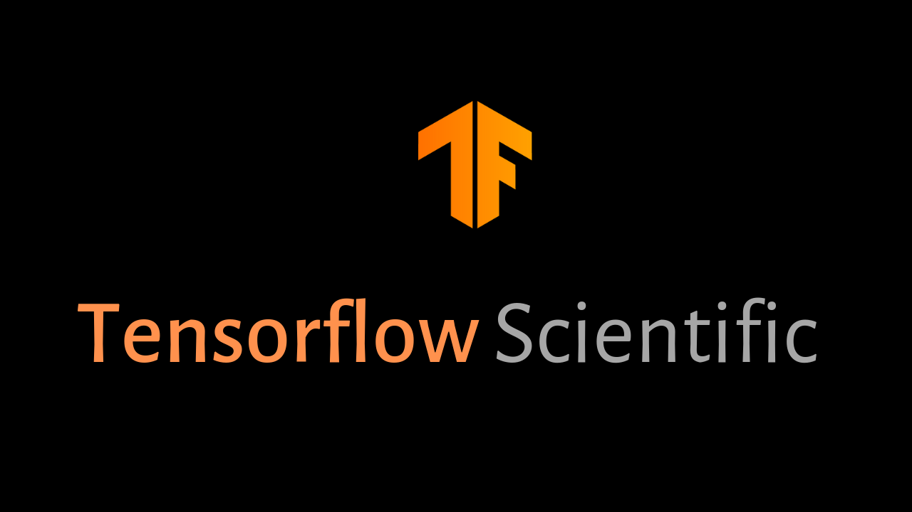

<h1 id="TensorflowScientific" align="center" >Tensorflow Scientific</h1>

    
    

    <a href="#page_facing_up-introduction">Introduction</a> •
    <a href="#wrench-installation">Installation</a> •
    <a href="#file_folder-subpackages">Subpackages</a> •
    <a href="#orange_book-examples">Examples</a> •
    <a href="#octocat-upcoming-releases">Upcoming Releases</a> •
    <a href="#soon-to-do">TO DO</a> •
    <a href="#speech_balloon-faq">FAQ</a> •

<h2 align="center">:page_facing_up: Introduction</h2>

TensorFlow Scientific (TFS) is a Python library built on TensorFlow for scientific computing.
TensorFlow Scientific contains modules for integration, ODE solvers and other tasks common in science and engineering.

<h2 align="center">:wrench: Installation</h2>

**WORK IN PROGRESS**

<h2 align="center">:file_folder: Subpackages</h2>

<a href="#TensorflowScientific">▴ Back to top</a>

[tfs.integrate](tensorflow_scientific/integrate/README.md)

- Functionality:

[tfs.solvers](tensorflow_scientific/solvers/README.md)

- Functionality:

[tfs.quantum](tensorflow_scientific/quantum/README.md)

- Functionality:

<h2 align="center">:orange_book: Examples</h2>

<a href="#TensorflowScientific">▴ Back to top</a>

**WORK IN PROGRESS**

<h2 align="center">:octocat: Upcoming Releases</h2>

<a href="#TensorflowScientific">▴ Back to top</a>

:fire: 0.1.0 Developer Alpha

- tfs.integrate

:fire: 0.2.0 Developer Alpha

- tfs.solvers

:fire: 0.3.0 Developer Alpha

- tfs.quantum

<h2 align="center">:soon: TO DO</h2>

<a href="#TensorflowScientific">▴ Back to top</a>

- Pypi package badges
- Official builds badges
- Issue tracking badges
- code quality badges
- code coverage badges
- Add development environment to contributing.md
- Add code contributing to contributing.md
- Add Contributor License Agreement to contributing.md
- Add some examples

<h2 align="center">:speech_balloon: FAQ</h2>

<a href="#TensorflowScientific">▴ Back to top</a>

Q1. How do I contribute?

TF-Scientific is a community led open source project. As such, the project
depends on public contributions, bug-fixes, and documentation. Please
see [contribution guidelines](CONTRIBUTING.md) for a guide on how to
contribute. This project adheres to [TensorFlow's code of conduct](CODE_OF_CONDUCT.md).
By participating, you are expected to uphold this code.
